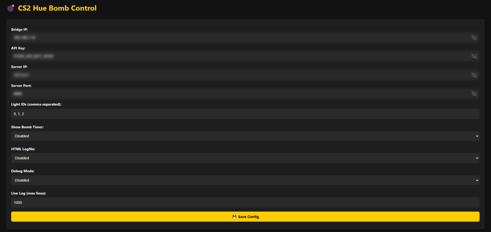
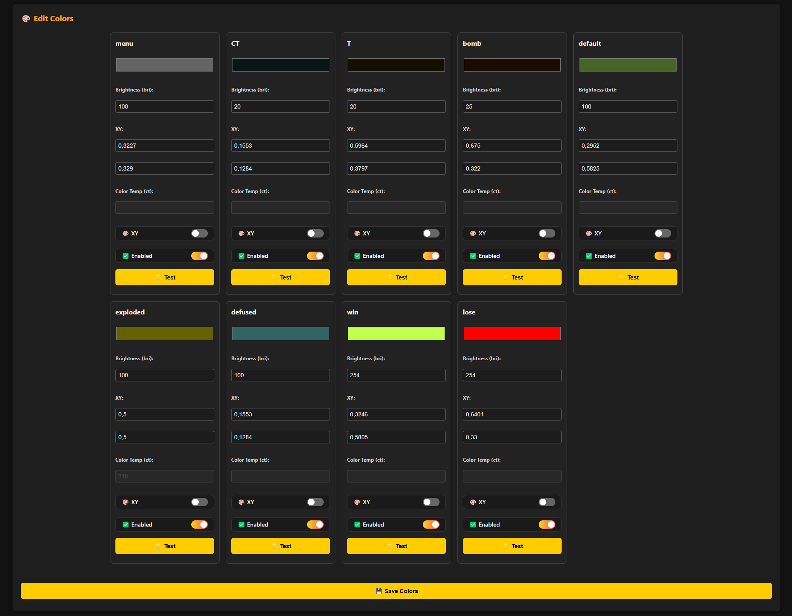
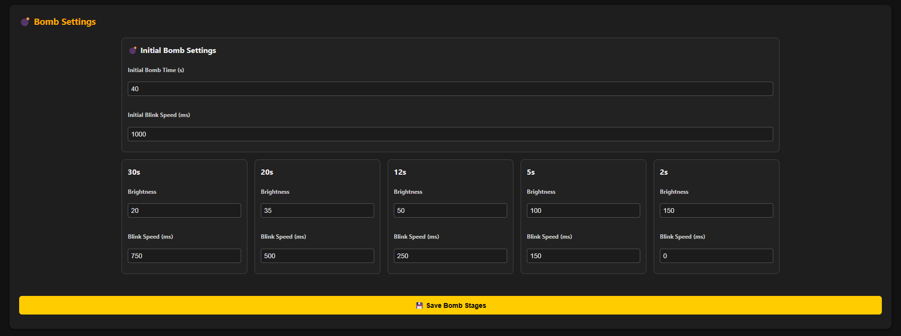

# 💣 CS2Hue: Hue Bomb Control for CS2

[](https://www.electronjs.org/) 
[](https://www.counter-strike.net/cs2) 
[](https://dringewald.github.io/CS2HUE/)
[](https://opensource.org/licenses/MIT)<br/>
[](https://openai.com/chatgpt)
[](https://discord.gg/jymDumdFVU)
[](https://www.paypal.com/paypalme/NoXHolt)
[](https://steamcommunity.com/id/nox_holt)

**CS2Hue** is an advanced Electron-based tool that syncs your Philips Hue lights with in-game bomb events in Counter-Strike 2 (CS2).  
It reacts live to bomb plants, explosions, defuses, round wins/losses, and team changes — **bringing your game to life with dynamic lighting**! 🌈

📖 **[View the Full Documentation](https://dringewald.github.io/CS2HUE/)**  

## 🎮 Features

- 🎯 Live CS2 bomb event detection (Plant, Defuse, Explode)
- 💡 Dynamic Philips Hue light control
- 🎨 Customizable colors (per team, bomb stages, menu)
- ⏱️ Adaptive bomb timer blink effects
- 🌐 HTML-based live log viewer (optional)
- ⚙️ Full configuration UI inside the app
- 🛡️ Debug Mode for troubleshooting
- 🔄 Auto-reconnect and fail-safe recovery

## 🚀 Quickstart

1. **Download the Application**  
   👉 Get it from the **[RELEASES](https://github.com/dringewald/CS2HUE/releases)** page.

2. **Unzip the Application**  
   👉 Extract it anywhere you like.

3. **Copy gamestate_integration_cs2hue.cfg to your CS2 folder**  

   Default CS2 Config Path:
   ```
   C:\Program Files (x86)\Steam\steamapps\common\Counter-Strike Global Offensive\csgo\cfg
   ```

   **If using 64-bit Steam install:**
   ```
   C:\Program Files\Steam\steamapps\common\Counter-Strike Global Offensive\csgo\cfg
   ```

4. **Install the Application**
   👉 Launch the setup for your system.

5. **Start the Application**  
   👉 Launch the application.

6. **Configure Hue Settings**  
   👉 Fill in:
   - **Hue Bridge IP** and **API Key**
   - **Light IDs** (comma-separated, e.g., `1,2,3`)
   - **Server IP** and **Port**
   👉 Save and hit **Start!** 🎯

## 🔬 Tutorial: How to Find Your Configuration Information
> 📖 For a complete tutorial with screenshots, visit the **[official documentation](https://dringewald.github.io/CS2HUE/)**.

**Hue Bridge IP**
- Find it via [https://discovery.meethue.com/](https://discovery.meethue.com/) (same network as bridge).

**API Key**
- Visit: `http://YOUR_BRIDGE_IP/debug/clip.html`
- URL field: `/api`
- Message Body:
  ```json
  {"devicetype":"CS2HUE#device"}
  ```
- Press the Hue Bridge button → Click **POST** → Copy value of the `username` field.

**Light IDs**
- Visit: `http://YOUR_BRIDGE_IP/debug/clip.html`
- URL field: `/api/YOUR_API_KEY/lights`
- Click **GET** and then find the light name and note the ID number (it's usually right above "state").

## ⚡ Build & Package the Application (Advanced)

> ⚠️ These steps are for developers or advanced users.  
> Most users should simply download a ready-made installer from the [RELEASES](https://github.com/dringewald/CS2HUE/releases) page.

### 🛠 Build from Source

1. **Install Node.js**  
   👉 [Download Node.js](https://nodejs.org/)

2. **Install dependencies**

   ```bash
   npm install
   ```

3. **Copy the CS2 integration file**  
   Place `gamestate_integration_cs2hue.cfg` into your CS2 config folder: 
   `C:\Program Files (x86)\Steam\steamapps\common\Counter-Strike Global Offensive\csgo\cfg`

4. **Run the app in development mode**

   ```bash
   npm start --no-timers-throttle
   ```

5. **Configure settings**  
Use the built-in GUI to input your Hue settings — or manually edit `config.json`.

---

### 📦 Package the Application

1. **⚠️ Remove personal API keys before packaging**  
Make sure your `config.json` does **not** include sensitive values like your `API_KEY`.

2. **Build the production package**

   ```bash
   npm run dist
   ```

3. **Locate the installer**  
After the build completes, the installer can be found inside the `dist/` directory.

4. **Install and test the app**  
- Run the installer.
- Launch CS2Hue.
- Enter your settings in the GUI.
- Click **Save**, then **Start** the script.
- Enjoy the synced lighting experience! 💣💡

## ⚙️ Configuration Overview

You can configure everything easily inside the app, or manually edit config.json:

```json
{
  "BRIDGE_IP": "192.168.1.10",
  "API_KEY": "YOUR_API_KEY_HERE",
  "SERVER_HOST": "127.0.0.1",
  "SERVER_PORT": 8080,
  "LIGHT_ID": "0, 1, 2",
  "SHOW_BOMB_TIMER": false,
  "HTML_LOG": false,
  "DEBUG_MODE": false,
  "LIVE_LOG_LINES": 1000
}
```
| Key               | Default Value        | Description |
|-------------------|-----------------------|-------------|
| `BRIDGE_IP`       | `"192.168.1.10"`       | The IP address of your Philips Hue Bridge. Find it via the Hue app or your router. |
| `API_KEY`         | `"YOUR_API_KEY_HERE"`  | Your authorized Hue API key. Needed to control the lights. |
| `SERVER_HOST`     | `"127.0.0.1"`          | Host address where the local server listens for game data. Leave as `127.0.0.1` unless you know what you're doing. |
| `SERVER_PORT`     | `8080`                 | Port for the server. If 8080 is taken, change this to another available port. |
| `LIGHT_ID`        | `"0, 1, 2"`            | Comma-separated list of Hue light IDs you want to control. Get IDs via the Hue API or developer tools. |
| `SHOW_BOMB_TIMER` | `false`                | Enables extra logs showing the bomb countdown (only if a bomb is planted). |
| `HTML_LOG`        | `false`                | If true, saves the full session log into an HTML file under `/logs/`. Useful for debugging. |
| `DEBUG_MODE`      | `false`                | Enables extra `[DEBUG]` logs in the console for troubleshooting. |
| `LIVE_LOG_LINES`  | `1000`                 | Max number of log lines to keep in memory for the HTML live view. Adjust higher for long sessions if needed. |

## 📂 Paths (Windows / macOS / Linux)

When CS2Hue is **installed**, files and logs are placed in OS-specific locations.

### 📦 Installed Application Paths
| Purpose             | Windows                                                | macOS                                         | Linux                                             |
|---------------------|--------------------------------------------------------|-----------------------------------------------|---------------------------------------------------|
| **App Executable**  | `C:\Users\<username>\AppData\Local\Programs\cs2hue\`   | `/Applications/CS2Hue.app`                    | Varies (e.g. `/opt/CS2Hue`, or where AppImage is) |
| **App Code (asar)** | `resources\app.asar` inside install dir               | `CS2Hue.app/Contents/Resources/app.asar`      | Inside AppImage or extracted folder               |

### 📂 User Data & Config Paths

CS2Hue stores and loads configuration and logs from the following locations, depending on your OS and whether the app is packaged or running in dev mode:

### 🪟 Windows

| Purpose        | Path                                                                 |
|----------------|----------------------------------------------------------------------|
| User Data      | `C:\Users\<username>\AppData\Roaming\cs2hue\`                        |
| Config File    | `C:\Users\<username>\AppData\Roaming\cs2hue\config.json`             |
| Colors File    | `C:\Users\<username>\AppData\Roaming\cs2hue\colors.json`             |
| Logs Folder    | `C:\Users\<username>\AppData\Roaming\cs2hue\logs\`                   |

### 🐧 Linux

| Purpose        | Path                                                                 |
|----------------|----------------------------------------------------------------------|
| User Data      | `/home/<username>/.config/cs2hue/`                                   |
| Config File    | `/home/<username>/.config/cs2hue/config.json`                        |
| Colors File    | `/home/<username>/.config/cs2hue/colors.json`                        |
| Logs Folder    | `/home/<username>/.config/cs2hue/logs/`                              |

### 🍏 macOS

| Purpose        | Path                                                                 |
|----------------|----------------------------------------------------------------------|
| User Data      | `/Users/<username>/Library/Application Support/cs2hue/`              |
| Config File    | `/Users/<username>/Library/Application Support/cs2hue/config.json`   |
| Colors File    | `/Users/<username>/Library/Application Support/cs2hue/colors.json`   |
| Logs Folder    | `/Users/<username>/Library/Application Support/cs2hue/logs/`         |

> These paths are used when CS2Hue is installed using the official setup or packaged release.
>
> When you want to build the app, then the files are read from the project folder (same directory as `main.js`).
>
> **IMPORTANT**: These paths are untested on MacOS and Linux (Feedback is appreciated)!

## 🧹 How It Works

- CS2 sends real-time game information to the server set in the **gamestate config file**.
- CS2Hue **spins up a lightweight local server** listening on the configured IP/Port.
- The app **receives game events almost instantly** using a **fast polling system**.
- CS2Hue **dynamically updates your Hue lights** based on bomb events or round outcomes.
- Full customization of lighting behavior is available!

## 🛠 Developer Guide

- Main app: [`main.js`](./main.js)
- Frontend: [`index.html`](./index.html) + [`renderer.js`](./renderer.js)
- Backend logic: [`logic.js`](./logic.js)
- Logging module: [`logger.js`](./logger.js)
- Config file: [`config.json`](./config.json)

Frameworks/Technologies:
- ⚡ Electron
- 🎨 Native HTML/CSS/JS
- 📡 Node.js
- 🖼️ Philips Hue Local API

## 📸 Screenshots

| Config Editor | Color Editor | Bomb Stages |
|:-------------:|:------------:|:-----------:|
|  |  |  |

## ⚡ Pro Tips

- 💡 **Test colors live** using the "💡 Test" button.
- 🔄 **Lights recover automatically** after errors or disconnections.
- 🐞 **Enable Debug Mode** for detailed logs.
- 🚀 **Optimized** for background performance — no CPU throttling.


## 📜 License

[MIT License](./LICENCE) — free to use, modify, and distribute.  
Attribution is appreciated but not required. ❤️

## 💬 Credits

Project by **[Dustin Ringewald](https://github.com/dringewald)**.

Special thanks to:
- Valve (for CS2 Gamestate integration)
- Node.js & Electron communities
- Hue Developer community

✨ **Massive thanks to [floranknz](https://github.com/floranknz) for the original [CS2HUE](https://github.com/floranknz/CS2HUE) idea and script!**

# 🧠 FAQ

**Q: My lights don't react! What should I check?**
- Make sure your Bridge IP/API Key are correct.
- Ensure lights are **not** in "Entertainment/Sync" mode.
- Verify the CS2 gamestate file is updating.

**Q: Can I add custom bomb timings?**
- Yes! Edit bomb stages inside the app's bomb settings UI.

**Q: Will you add support for more games?**
- 🚀 It's not planned currently, but who knows maybe in the future! Feel free to contribute or fork the project!

**Q: Can I get a VAC ban for using CS2Hue?**  
- ❗ **No.** CS2Hue only **reads** gamestate files — it does **not modify** the game, **inject code**, or **interact with the CS2 process** in any way.  
  Gamestate files are widely used by official RGB integrations from companies like **Logitech**, **SteelSeries**, and others.
- ⚠️ A VAC ban is therefore **extremely unlikely** and **practically ruled out** under normal usage.
- ⚡ **However,** I cannot guarantee or accept any responsibility for potential bans or other consequences. **Use at your own risk.**

> *All mentioned trademarks and brands are the property of their respective owners. CS2Hue is not affiliated with or endorsed by any of them.*
